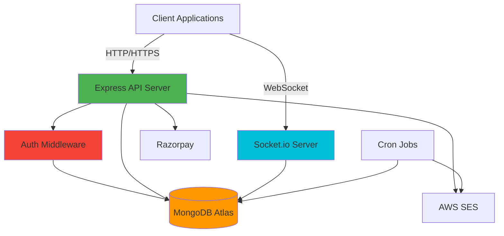

# DevTinder — Backend 🚀

<div align="center">


**Production-ready Node.js backend powering the DevTinder developer-matching platform**

[Live API](https://thedevtinder.live/api) • [Frontend Repo](https://github.com/Lokeshsuwalka05/Devtinder-Backend) • [Documentation](#-api--socket-endpoints) • [Report Bug](https://github.com/Lokeshsuwalka05/Devtinder-Backend/issues)

</div>

---

## 📖 About The Project

DevTinder Backend is a comprehensive microservices-ready Node.js application that powers a developer-matching and collaboration platform. Built with scalability, security, and real-time communication at its core, this service handles authentication, real-time chat, payment processing, email delivery, and scheduled background tasks.

### ⚠️ **100% Human-Written Code**

> Every single line of code in this repository is manually crafted by me — no AI assistance, no code generators, no shortcuts. This represents authentic software engineering and deep understanding of backend architecture.

---

## 🌟 Key Features

<table>
<tr>
<td width="50%">

### 🔐 Secure Authentication

- JWT-based authentication system
- Password hashing with bcrypt
- Protected route middleware
- Session management with cookies

### 💬 Real-time Chat

- Socket.io powered messaging
- Room-based conversations
- Typing indicators & presence
- Message persistence

### 💳 Payment Integration

- Razorpay order creation
- Webhook verification
- Secure payment processing
- Transaction logging

</td>
<td width="50%">

### 📧 Email Service

- AWS SES integration
- Transactional emails
- Email templates
- Delivery tracking

### ⏰ Scheduled Tasks

- Cron job automation
- Data cleanup routines
- Reminder notifications
- Report generation

### 🛡️ Security Features

- Input validation
- CORS protection
- XSS prevention
- Rate limiting ready

</td>
</tr>
</table>

---

## 🏗️ Architecture Overview



---

## 📂 Project Structure

 **Organized for scalability and maintainability**

```
src/
├── config/
│   └── Database.js              # MongoDB connection setup
├── middlewares/
│   └── auth.js                  # JWT verification middleware
├── models/
│   ├── chat.js                  # Chat schema & methods
│   ├── connectionRequest.js     # Connection request schema
│   ├── payment.js               # Payment transaction schema
│   └── user.js                  # User profile schema
├── routes/
│   ├── auth.js                  # Authentication endpoints
│   ├── chat.js                  # Chat REST endpoints
│   ├── payment.js               # Payment endpoints
│   ├── profile.js               # User profile management
│   ├── requests.js              # Connection request handling
│   └── user.js                  # User operations
└── utils/
    ├── cronJob.js               # Scheduled task definitions
    ├── razorpay.js              # Razorpay client setup
    ├── sendEmail.js             # Email sending logic
    ├── sesClient.js             # AWS SES client
    ├── sockets.js               # Socket.io event handlers
    ├── validation.js            # Input validation functions
    └── app.js                   # Express app initialization
```

**Architecture Philosophy:** Modular design with clear separation between routes, business logic, data models, and utilities. Each layer is independent and testable.

---

## 🛠️ Tech Stack

<table>
<tr>
<td valign="top" width="50%">

### Core Technologies

- **Node.js** — JavaScript runtime
- **Express 5** — Web framework
- **MongoDB** — NoSQL database
- **Mongoose** — ODM for MongoDB

### Authentication & Security

- **jsonwebtoken** — JWT implementation
- **bcrypt** — Password hashing
- **cookie-parser** — Cookie handling
- **validator** — Input validation

</td>
<td valign="top" width="50%">

### Real-time & Communication

- **Socket.io** — WebSocket library
- **@aws-sdk/client-ses** — Email service
- **cors** — CORS middleware

### Payment & Scheduling

- **Razorpay** — Payment gateway
- **node-cron** — Task scheduler
- **date-fns** — Date utilities

</td>
</tr>
</table>

---

## 🚀 Getting Started

### Prerequisites

```bash
Node.js >= 18.x
MongoDB Atlas account (or local MongoDB)
AWS account with SES configured
Razorpay account (test/live credentials)
```

### Installation

1️⃣ **Clone the repository**

```bash
git clone https://github.com/Lokeshsuwalka05/Devtinder-Backend.git
cd Devtinder-Backend
```

2️⃣ **Install dependencies**

```bash
npm install
# or
npm ci  # for production
```

3️⃣ **Set up environment variables**

Create a `.env` file in the project root:

```env
# Database
MONGODB_URI=mongodb+srv://<user>:<password>@cluster0.mongodb.net/devtinder?retryWrites=true&w=majority

# Authentication
JWT_SECRET=your_super_secure_jwt_secret_key_here

# AWS SES Configuration
AWS_SES_ACCESS_KEY=AKIA...
AWS_SES_SECRET_ACCESS_KEY=your_aws_secret_key

# Razorpay
Razorpay_key_secret=rzp_live_xxx_or_rzp_test_xxx
Razorpay_webhook_secret=whsec_xxx

# Server
PORT=5000
NODE_ENV=development
```

> ⚠️ **Security Note:** Never commit `.env` to version control. Add it to `.gitignore`.

4️⃣ **Start the development server**

```bash
npm start
```

The API will be running at `http://localhost:5000`

---

## 🔌 API & Socket Endpoints

### 🔐 Authentication Routes

| Method | Endpoint  | Description       | Auth Required |
| ------ | --------- | ----------------- | ------------- |
| POST   | `/signup` | Register new user | ❌            |
| POST   | `/login`  | User login        | ❌            |
| POST   | `/logout` | User logout       | ✅            |

### 👤 Profile & User Routes

| Method | Endpoint          | Description                    | Auth Required |
| ------ | ----------------- | ------------------------------ | ------------- |
| GET    | `/profile/view`   | Get authenticated user profile | ✅            |
| PATCH  | `/profile/edit`   | Update user profile            | ✅            |
| PATCH  | `/patch/password` | Change password                | ✅            |
| GET    | `/user/:id`       | Get public user profile        | ✅            |

### 🤝 Connection Routes

| Method | Endpoint                 | Description             | Auth Required |
| ------ | ------------------------ | ----------------------- | ------------- |
| POST   | `/request/send`          | Send connection request | ✅            |
| POST   | `/request/review`        | Accept/Reject request   | ✅            |
| GET    | `/user/request/received` | List received requests  | ✅            |
| GET    | `/user/connections`      | List all connections    | ✅            |

### 📰 Feed Routes

| Method | Endpoint | Description   | Auth Required |
| ------ | -------- | ------------- | ------------- |
| GET    | `/feed`  | Get user feed | ✅            |

### 💬 Chat Routes

| Method | Endpoint | Description           | Auth Required |
| ------ | -------- | --------------------- | ------------- |
| GET    | `/chat`  | Get chat history/list | ✅            |

### 💳 Payment Routes

| Method | Endpoint           | Description              | Auth Required |
| ------ | ------------------ | ------------------------ | ------------- |
| POST   | `/create/order`    | Create Razorpay order    | ✅            |
| POST   | `/payment/webhook` | Razorpay webhook handler | ❌            |

### 🔌 Socket.io Events

```javascript
// Client → Server
socket.emit("joinRoom", { roomId, userId });
socket.emit("message", { roomId, message, senderId });
socket.emit("typing", { roomId, userId, isTyping });

// Server → Client
socket.on("message", (data) => {
  /* New message */
});
socket.on("userJoined", (data) => {
  /* User joined room */
});
socket.on("userLeft", (data) => {
  /* User left room */
});
socket.on("typing", (data) => {
  /* Typing indicator */
});
```

> 📝 **Detailed API documentation available in `api-list.md`**

---

## 🔒 Security Best Practices

<table>
<tr>
<td width="50%">

### Implemented Security Measures

✅ **JWT Authentication** with secure secret rotation  
✅ **Password Hashing** using bcrypt (10 rounds)  
✅ **Input Validation** on all endpoints  
✅ **CORS Configuration** with whitelist  
✅ **HTTP-only Cookies** for token storage  
✅ **Webhook Verification** for Razorpay  
✅ **Environment Variables** for secrets

</td>
<td width="50%">

### Production Checklist

🔒 Use HTTPS only in production  
🔒 Set secure cookie flags (`Secure`, `HttpOnly`, `SameSite`)  
🔒 Implement rate limiting (express-rate-limit)  
🔒 Enable MongoDB IP whitelist  
🔒 Rotate JWT secrets periodically  
🔒 Monitor failed login attempts  
🔒 Use AWS IAM roles for SES

</td>
</tr>
</table>

---

## 🌐 Deployment Guide (AWS EC2)

### Infrastructure Setup

```
┌─────────────────┐
│   CloudFlare    │  ← DNS & DDoS Protection
└────────┬────────┘
         │
┌────────▼────────┐
│  AWS EC2 Ubuntu │  ← Application Server
│   + Nginx       │
└────────┬────────┘
         │
    ┌────┴────┬──────────┬──────────┐
    │         │          │          │
┌───▼───┐ ┌──▼───┐ ┌────▼─────┐ ┌──▼──────┐
│MongoDB│ │ SES  │ │Razorpay  │ │Socket.io│
│ Atlas │ │      │ │          │ │         │
└───────┘ └──────┘ └──────────┘ └─────────┘
```

### Step-by-Step Deployment

**1. Provision EC2 Instance**

```bash
# Ubuntu 22.04 LTS
# t2.medium or higher recommended
# Open ports: 22, 80, 443, 5000
```

**2. Install Node.js & Dependencies**

```bash
# Update system
sudo apt update && sudo apt upgrade -y

# Install Node.js 18
curl -fsSL https://deb.nodesource.com/setup_18.x | sudo -E bash -
sudo apt install -y nodejs

# Install PM2 globally
sudo npm install -g pm2

# Install Nginx
sudo apt install -y nginx
```

**3. Deploy Application**

```bash
# Clone repository
git clone https://github.com/Lokeshsuwalka05/Devtinder-Backend.git
cd Devtinder-Backend

# Install dependencies
npm ci --production

# Set up environment variables
nano .env  # Add your production env vars

# Start with PM2
pm2 start src/app.js --name devtinder-backend
pm2 save
pm2 startup  # Enable auto-restart on reboot
```

**4. Configure Nginx as Reverse Proxy**

```nginx
# /etc/nginx/sites-available/devtinder-backend
server {
    listen 80;
    server_name api.thedevtinder.live;

    location / {
        proxy_pass http://localhost:5000;
        proxy_http_version 1.1;
        proxy_set_header Upgrade $http_upgrade;
        proxy_set_header Connection 'upgrade';
        proxy_set_header Host $host;
        proxy_set_header X-Real-IP $remote_addr;
        proxy_set_header X-Forwarded-For $proxy_add_x_forwarded_for;
        proxy_set_header X-Forwarded-Proto $scheme;
        proxy_cache_bypass $http_upgrade;
    }
}
```

```bash
# Enable site
sudo ln -s /etc/nginx/sites-available/devtinder-backend /etc/nginx/sites-enabled/
sudo nginx -t
sudo systemctl restart nginx
```

**5. Set Up SSL with Let's Encrypt**

```bash
sudo apt install certbot python3-certbot-nginx -y
sudo certbot --nginx -d api.thedevtinder.live
```

**6. Monitor & Maintain**

```bash
# View logs
pm2 logs devtinder-backend

# Monitor performance
pm2 monit

# Restart application
pm2 restart devtinder-backend
```

---

## 📊 Performance Optimization

- ✅ **Database Indexing** — Optimized queries with compound indexes
- ✅ **Connection Pooling** — MongoDB connection reuse
- ✅ **Compression** — Response compression middleware
- ✅ **Caching Strategy** — Redis-ready architecture
- ✅ **Load Balancing** — PM2 cluster mode support

---

## 🧪 Testing

```bash
# Run tests (if implemented)
npm test

# Test with curl
curl -X POST http://localhost:5000/signup \
  -H "Content-Type: application/json" \
  -d '{"email":"test@example.com","password":"Test123!"}'

# Socket.io testing with Postman or Socket.io client library
```

---

## 📦 Dependencies

<details>
<summary><b>View Complete Dependency List</b></summary>

```json
{
  "@aws-sdk/client-ses": "^3.x",
  "bcrypt": "^5.x",
  "cookie-parser": "^1.x",
  "cors": "^2.x",
  "date-fns": "^2.x",
  "dotenv": "^16.x",
  "express": "^5.x",
  "jsonwebtoken": "^9.x",
  "mongoose": "^7.x",
  "node-cron": "^3.x",
  "razorpay": "^2.x",
  "socket.io": "^4.x",
  "validator": "^13.x"
}
```

</details>

---

## 🤝 Contributing

This is my personal implementation where every line is hand-coded. Contributions are welcome!

### How to Contribute

1. 🍴 Fork the repository
2. 🌿 Create a feature branch (`git checkout -b feature/AmazingFeature`)
3. ✍️ Commit your changes (`git commit -m 'Add some AmazingFeature'`)
4. 📤 Push to the branch (`git push origin feature/AmazingFeature`)
5. 🎉 Open a Pull Request

**Code Standards:**

- Follow existing code style
- Add comments for complex logic
- Update documentation for API changes
- Test thoroughly before submitting

---

## 📄 License

**License:** ISC

**Author:** Lokesh Suwalka — Every line of code written by me (not AI-generated)

---

## 📬 Contact & Support

<div align="center">

**Lokesh Suwalka**

[](https://github.com/Lokeshsuwalka05)
[](mailto:support@thedevtinder.live)
[](https://thedevtinder.live)

**Found a bug?** [Open an issue](https://github.com/Lokeshsuwalka05/Devtinder-Backend/issues)

</div>

---

## 🎯 Roadmap

- [ ] Implement Redis caching layer
- [ ] Add comprehensive test suite
- [ ] GraphQL API endpoint
- [ ] Docker containerization
- [ ] Kubernetes deployment configs
- [ ] CI/CD pipeline with GitHub Actions
- [ ] API rate limiting
- [ ] Request logging with Winston

---

## 📚 Additional Resources

- 📖 [Detailed API Documentation](./api-list.md)
- 🎥 [Video Tutorial](#) _(Coming Soon)_
- 📝 [Blog Post: Building DevTinder](#) _(Coming Soon)_
- 🐳 [Docker Setup Guide](#) _(Coming Soon)_

---

<div align="center">

### ⭐ Star this repo if you find it useful!

**Built with ❤️ and ☕ by [Lokesh Suwalka](https://github.com/Lokeshsuwalka05)**

_Connecting developers, one line of code at a time_

</div>
